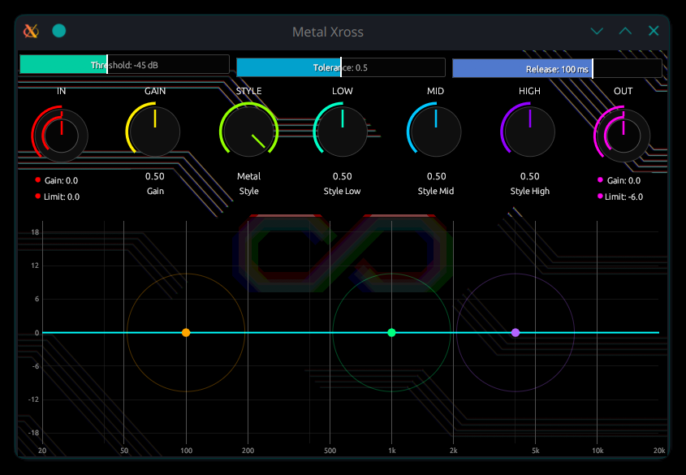

# Metal Xross



**Metal Xross** is a high-performance, modern distortion plugin built with Rust using the `nih-plug` framework and `egui`. Designed for guitarists and sound designers who demand aggressive yet controllable saturation, it combines four distinct distortion algorithms with a precision 3-band parametric equalizer.

## ⚡ Features

  * **Quad-Style Distortion Engine**: Seamlessly morph between four handcrafted distortion models using the `Kind` parameter:
      * **Crunch**: Vintage tube-like saturation with dynamic response.
      * **Drive**: Balanced overdrive for versatile rock tones.
      * **Distortion**: High-density, saturated clipping for modern hard rock.
      * **Metal**: Ultra-high gain with razor-sharp edges and massive sustain.
  * **Pre-Emphasis Style Shaping**: Adjust `Style Low/Mid/High` to shape the frequency response *before* it hits the distortion stage. This allows for tightening palm mutes or creating fuzzy, thick leads.
  * **Precision 3-Band Parametric EQ**: A post-distortion equalizer with real-time visual feedback.
      * **Low & High**: Shelf filters for weight and air.
      * **Mid**: Peaking filter for surgical frequency carving.
      * **Interactive UI**: Drag points to adjust Freq/Gain, and use the mouse wheel to control **Q-factor**.
  * **Intelligent Noise Gate**: A spectral-aware gate designed for high-gain playing.
      * **Tolerance**: Adjusts spectral sensitivity to preserve harmonics while killing hiss.
      * **Skewed Release**: Fine-tuned resolution for "Djent-style" rapid mutes.
  * **Professional I/O Stage**:
      * **Symmetrical Skewed Gain**: Natural volume control centered at 0dB.
      * **Safety Limiters**: Independent Input and Output limiters to prevent digital clipping.

## 🛠 Signal Chain

The internal processing follows a professional studio rack logic:

1.  **Input Stage**: Gain adjustment and initial Limiting.
2.  **Noise Gate**: Threshold-based suppression with spectral tolerance to clean up the DI signal.
3.  **Style Shaping**: 3-band pre-emphasis filtering.
4.  **Xross Gain**: The core distortion engine (Crunch → Metal).
5.  **Parametric EQ**: 3-band post-distortion tonal shaping.
6.  **Output Stage**: Final gain leveling and safety limiting.

## 🚀 Getting Started

### Prerequisites

  * [Rust](https://www.rust-lang.org/) (Latest stable)
  * `nih-plug` dependencies (see nih-plug documentation for your OS).

### Build

```bash
# Build the plugin in release mode
cargo build --release
```

## 🎛 Parameter Reference

| Group | Parameter | Range | Description |
| :--- | :--- | :--- | :--- |
| **Noise Gate** | Threshold | -70 to -10 dB | Level at which the gate opens. |
| | Tolerance | 0.0 to 1.0 | Harmonic preservation vs. tight cutting. |
| | Release | 1 to 500 ms | Speed of the gate closing (skewed for fast response). |
| **General** | Gain | 0.0 to 1.0 | Overall saturation/drive intensity. |
| | I/O Gain | -inf to +12 dB | Volume adjustment (0dB center). |
| | I/O Limit | -60 to 0 dB | Limiter ceiling for input and output. |
| **Style** | Kind | 0.0 to 3.0 | Morphs: Crunch(0) → Drive(1) → Dist(2) → Metal(3). |
| | Pre L/M/H | 0.0 to 1.0 | Pre-distortion frequency emphasis. |
| **Equalizer** | Freq | 20Hz to 20kHz | Center/Cutoff frequency (logarithmic scale). |
| | Gain | ±20 dB | Boost or cut for the specific band. |
| | Q | 0.1 to 10.0 | Bandwidth of the filter. |

## 📜 License

This project is licensed under the **MIT License**.
